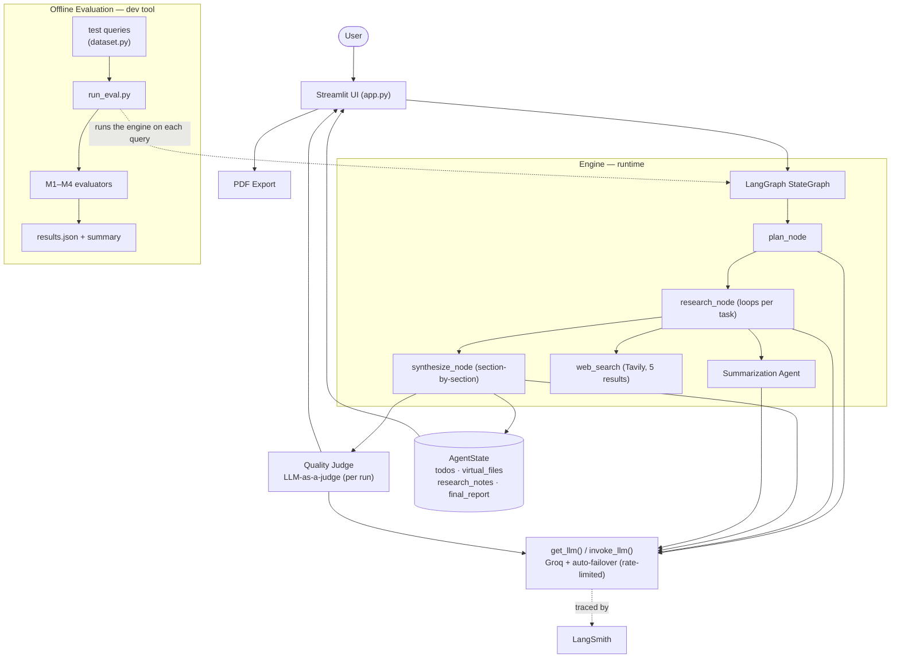
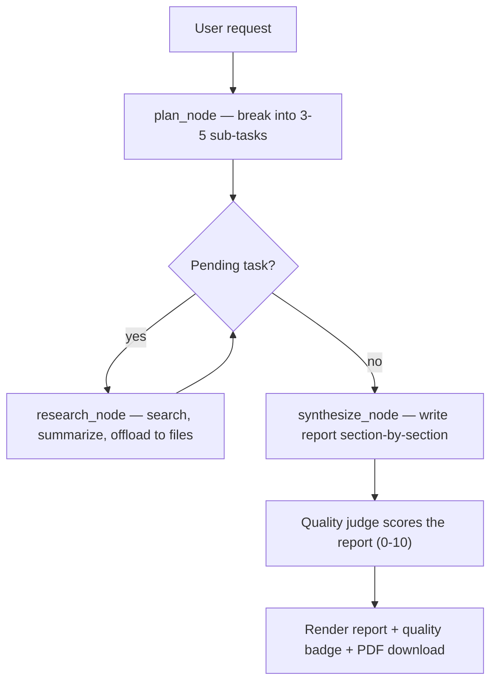
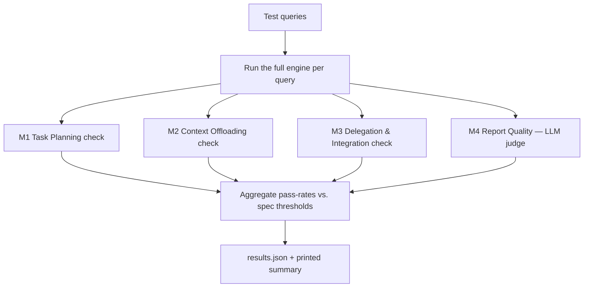

# 🧠 Autonomous Cognitive Engine

> A LangGraph-powered autonomous research agent that plans, searches the live web, manages its own memory, delegates to a specialist sub-agent, scores its own output, and writes a sourced report — end to end, on free APIs, with automatic model failover.


---

## Overview

Large language models excel at single answers but struggle with **long-horizon tasks** — work that needs planning many steps ahead, gathering and remembering large amounts of information, and staying coherent across dozens of intermediate actions. A naive agent loop tends to lose the thread, overflow its context window, or do steps in the wrong order.

The **Autonomous Cognitive Engine** tackles this with three ideas working together:

- **Explicit planning** — the request is decomposed into a tracked list of sub-tasks before any work begins.
- **Context offloading** — findings are written to a virtual file system in the graph state, so the model never has to hold everything in its limited context at once.
- **Graph-enforced orchestration** — a LangGraph `StateGraph` defines the execution order in code, so the system always plans, then researches each task in turn, then synthesizes. The model decides language; the graph decides flow.

Give it a request like *"Research the main risks and benefits of solar energy"* and it returns a structured, source-cited report — scored for quality, viewable in the browser, and downloadable as a formatted PDF.

---

## Features

- **Task planning** — `plan_node` decomposes a request into 3–5 sub-tasks tracked as a to-do list (`pending` / `running` / `completed`).
- **Virtual file system & context offloading** — `ls`, `read_file`, `write_file`, `edit_file` tools read/write a `virtual_files` dictionary in state; research findings are saved as `findings_*.md` instead of accumulating in context.
- **Multi-agent design** — specialist agents built with LangChain's `create_agent` (research, search, summarization); the graph delegates findings-condensing to the summarization agent each research step.
- **Live web search** — Tavily integration returns clean, agent-ready results (5 results per query).
- **Stateful LangGraph workflow** — a `StateGraph` over a shared `AgentState`, with a conditional edge that loops research until every task is done.
- **Section-by-section report synthesis** — `synthesize_node` composes the final report one section at a time (Overview, Key Findings, Analysis, Conclusion), so each section gets a full output budget and the report never truncates before its conclusion.
- **Live quality scoring** — an LLM-as-a-judge scores each finished report 0–10 and shows a colored **Quality Score** badge in the UI.
- **Automatic model failover** — every model call routes through a single access point that automatically fails over `gpt-oss-120b → gpt-oss-20b → llama-3.3-70b-versatile` on a rate-limit (429) error, so a single exhausted quota doesn't stop a run.
- **PDF export** — `pdf_service` builds a downloadable PDF with a cover page, styled headings, **real rendered tables**, clickable links, and page numbers (ReportLab, generated in memory).
- **Polished Streamlit UI** — gradient hero, example prompts, live execution dashboard (progress bar, current-task banner, color-coded task board), tabbed results (Report / Memory / Plan), run metrics, quality badge, PDF download, and reset.
- **Automated evaluation suite** — an offline harness that scores the engine against four milestone metrics, including an LLM-as-a-judge for report quality (see [Evaluation](#evaluation)).
- **LangSmith tracing** — every run is automatically traced for full step-by-step observability.
- **Shared rate limiting** — a single `InMemoryRateLimiter` paces all requests to stay within free-tier limits.

---

## Architecture

The system has a **runtime engine** (the LangGraph that answers a request, including a per-run quality judge) and a separate **offline evaluation harness** (a developer tool that runs the engine on test queries and grades it). The diagram shows both — note the evaluation suite is *outside* the user request path.



---

## Workflow

### Runtime workflow (answering a request)



### Evaluation workflow (offline QA)



**Runtime, step by step:** the request enters the graph; `plan_node` decomposes it into `pending` sub-tasks; `research_node` takes each pending task, runs a Tavily search (in code), delegates condensing to the summarization agent, saves findings to `virtual_files` and `research_notes`, and marks it `completed`; a conditional edge loops until none remain; `synthesize_node` writes `final_report` one section at a time; a quality judge scores it; the UI renders the report, badge, and PDF download.

---

## Project Structure

```
Autonomous_Cognitive_Engine/
├── app.py                       # Streamlit entry point: UI + drives the graph
├── requirements.txt
├── .env.example                 # Template of required environment variables
├── .gitignore
├── LICENSE                      # MIT
├── .streamlit/
│   └── config.toml              # Dark theme + primary color
├── config/
│   └── settings.py              # Keys, provider, model, rate, validate_settings()
├── state/
│   └── agent_state.py           # Todo + AgentState (the shared "whiteboard")
├── tools/
│   ├── planning_tools.py        # write_todos
│   ├── file_system_tools.py     # ls, read_file, write_file, edit_file
│   └── search_tools.py          # web_search (Tavily, 5 results)
├── agents/
│   ├── research_agent.py        # build_research_agent (search + file tools)
│   ├── search_agent.py          # build_search_agent (search only)
│   └── summarization_agent.py   # build_summarization_agent (no tools)
├── graph/
│   ├── nodes.py                 # plan_node, research_node, synthesize_node
│   └── build_graph.py           # build_graph(), conditional research loop
├── services/
│   ├── llm_service.py           # get_llm(), invoke_llm(), call_with_failover()
│   └── pdf_service.py           # generate_report_pdf() — tables, cover, links
├── ui/
│   ├── styles.py                # load_css()
│   └── components.py            # progress / current_task / todo_board / memory / stats / quality_badge
├── utils/
│   └── helpers.py               # message_text(), clean_for_display()
└── evaluation/
    ├── dataset.py               # test queries
    ├── evaluators.py            # M1–M4 evaluators + score_report_for_display()
    └── run_eval.py              # runner: scores + saves results.json
```

*(Each package folder also contains an `__init__.py`.)*

---

## Tech Stack

| Component             | Technology                                          |
|-----------------------|-----------------------------------------------------|
| Language              | Python 3.11+                                         |
| Orchestration         | LangGraph (>= 1.0) — `StateGraph`                    |
| Agent framework       | LangChain (>= 1.0) — `create_agent`, tools           |
| LLM provider (main)   | Groq — `openai/gpt-oss-120b`                         |
| LLM failover chain    | `gpt-oss-120b` → `gpt-oss-20b` → `llama-3.3-70b-versatile` |
| LLM provider (alt)    | Google Gemini (`langchain-google-genai` >= 4.0)      |
| Web search            | Tavily (`langchain-tavily`)                          |
| Observability         | LangSmith                                            |
| Rate limiting         | `langchain-core` `InMemoryRateLimiter`               |
| UI                    | Streamlit                                            |
| PDF generation        | ReportLab                                            |
| Config / secrets      | python-dotenv                                        |

### Model strategy & automatic failover

The default model is **`openai/gpt-oss-120b`** — on Groq's free tier it has the best quality and the largest daily token budget (~200K tokens/day). Because Groq tracks limits **separately per model**, all model access flows through a single chokepoint (`get_llm()` / `invoke_llm()`) that implements **automatic failover**: when a call hits a rate-limit (429) or daily-quota error, the engine transparently advances to the next model in the chain — `gpt-oss-120b → gpt-oss-20b → llama-3.3-70b-versatile` — and continues the run instead of failing. The fallback models each draw on a separate quota bucket, so an exhausted main model no longer stops a run. `gpt-oss-120b` remains the committed default; failover is runtime resilience underneath it.

---

## Installation

```bash
# 1. Clone
git clone https://github.com/Subhashreepattnaik/Autonomous_Cognitive_Engine.git
cd Autonomous_Cognitive_Engine

# 2. Create & activate a virtual environment
python -m venv venv
venv\Scripts\activate          # Windows
# source venv/bin/activate     # macOS / Linux

# 3. Install dependencies
pip install -r requirements.txt

# 4. Configure environment variables
copy .env.example .env         # Windows  (cp on macOS / Linux)
# then open .env and add your keys
```

---

## Environment Variables

Configured in `.env` (loaded by `config/settings.py` via python-dotenv). See `.env.example`:

| Variable             | Required | Purpose                                                   |
|----------------------|----------|-----------------------------------------------------------|
| `GROQ_API_KEY`       | Yes*     | Groq LLM access (all models in the failover chain)        |
| `TAVILY_API_KEY`     | Yes      | Tavily web search                                         |
| `GOOGLE_API_KEY`     | Optional | Google Gemini (only if `LLM_PROVIDER` is set to `gemini`) |
| `LANGSMITH_TRACING`  | Optional | Set to `true` to enable tracing                           |
| `LANGSMITH_API_KEY`  | Optional | LangSmith authentication                                  |
| `LANGSMITH_PROJECT`  | Optional | Project name traces are grouped under                     |

\* `validate_settings()` requires `TAVILY_API_KEY` plus the key for the active `LLM_PROVIDER` (`GROQ_API_KEY` by default).

---

## Usage

Launch the app from the project root with the virtual environment active:

```bash
streamlit run app.py
```

Open the printed URL (usually `http://localhost:8501`), then:

1. Click an example prompt or type your own research request.
2. Press **Start Research**.
3. Watch the live dashboard — the progress bar climbs and task cards flip to completed as the engine works.
4. Read the report under the **Report** tab (with its **Quality Score** badge), inspect saved notes under **Memory**, review the **Plan**.
5. Click **Download PDF** to save the report.

> **Free-tier note:** the LLM and search providers are rate-limited per minute and per day. A shared rate limiter paces requests automatically, and if a model's quota is exhausted mid-run, the engine fails over to the next model in the chain (`120b → 20b → 70b`) without manual intervention.

---

## Evaluation

The project includes an automated evaluation suite (`evaluation/`) that scores the engine against the four milestone criteria from the project specification. It runs the full graph on a set of research queries and grades each run on four metrics — the first three are deterministic structural checks (verifying the mechanism fired, the same evidence a LangSmith trace shows), and the fourth uses an **LLM-as-a-judge** to grade final-report quality.

Run it with:

```bash
python -m evaluation.run_eval
```

### Results

| Milestone | Metric | Target | Result |
|-----------|--------|--------|--------|
| M1 | Task Decomposition Accuracy | ≥ 80% | **100%** ✅ |
| M2 | Context Offloading (file system usage) | ≥ 80% | **100%** ✅ |
| M3 | Delegation & Result Integration | ≥ 80% | **100%** ✅ |
| M4 | Report Quality (LLM-as-a-judge) | ≥ 70% | 0–67% (across runs) ⚠️ |

*(Measured on a 3-query dataset using the free `openai/gpt-oss-120b` model on Groq. Individual reports score "Good" (6–8/10) in the live app.)*

### Analysis

The core architecture passes every structural milestone at 100% — planning, context offloading, and delegation all work reliably across queries.

**M4 (report quality) tells a build → measure → fix story.** The evaluation suite first caught that final reports **truncated before the Conclusion** (scoring 0–33%), which was root-caused to the reasoning model spending its output-token budget on internal reasoning. This was fixed by **section-by-section synthesis** — composing each report section in its own call so none truncates — which eliminated the truncation and roughly doubled M4 (to ~67% at its best). The remaining gap reflects strict LLM-based quality judging on a small 3-query dataset running on free-tier models, where reports are complete and cited but limited in source depth. The score varies run-to-run because three samples near the judge's pass/fail boundary is inherently noisy.

This is a representative real-world constraint of building a token-hungry multi-agent system on free APIs (~200K tokens/day) — documented transparently rather than masked by an easier test set.

---

## Future Improvements

- **Persistent semantic memory** — back the virtual file system with a vector store (e.g. ChromaDB) for recall across runs.
- **Deeper / primary-source research** — gather more and higher-quality sources per task to improve report depth.
- **Human-in-the-loop planning** — let the user approve or edit the plan before research begins.
- **Parallel research** of independent sub-tasks with token-budget awareness.
- **Larger evaluation dataset** — expand beyond 3 queries to stabilise the M4 metric.

---

## Contributors

- **Subhashree Pattnaik** — author and developer.

---

## License

Released under the [MIT License](LICENSE).