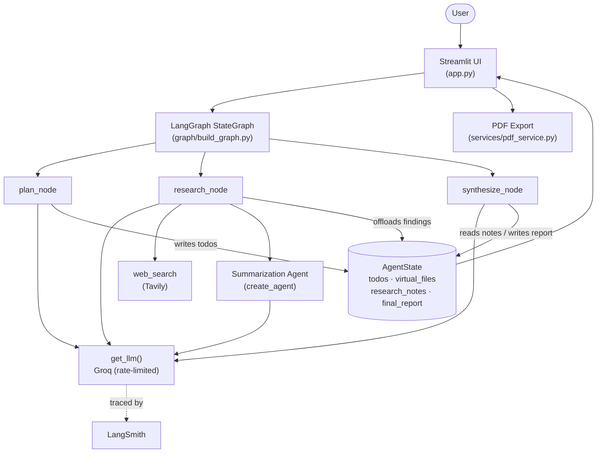
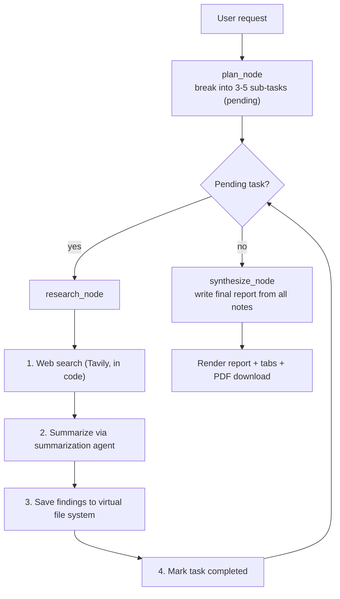

# 🧠 Autonomous Cognitive Engine

> A LangGraph-powered autonomous research agent that plans, searches the live web, manages its own memory, and writes a sourced report — end to end, on free APIs.


---

## Overview

Large language models are excellent at single-shot answers but struggle with **long-horizon tasks** — work that requires planning many steps ahead, gathering and remembering large amounts of information, and staying coherent across dozens of intermediate actions. A naive agent loop tends to lose the thread, overflow its context window, or perform steps in the wrong order.

The **Autonomous Cognitive Engine** addresses this with three ideas working together:

- **Explicit planning** — the request is decomposed into a tracked list of sub-tasks before any work begins.
- **Context offloading** — findings are written to a virtual file system inside the graph state, so the model never has to hold everything in its limited context at once.
- **Graph-enforced orchestration** — a LangGraph `StateGraph` defines the execution order in code, so the system always plans, then researches each task in turn, then synthesizes — the model decides language, the graph decides flow.

Give it a request like *"Research the main risks and benefits of solar energy"* and it returns a structured, source-cited report you can read in the browser or download as a PDF.

---

## Features

- **Task planning** — `plan_node` decomposes a request into 3–5 sub-tasks stored as a tracked to-do list (`pending` / `running` / `completed`).
- **Virtual file system & context offloading** — `ls`, `read_file`, `write_file`, and `edit_file` tools read and write a `virtual_files` dictionary in the graph state; research findings are saved as `findings_*.md` files instead of accumulating in the context window.
- **Multi-agent design** — specialist agents built with LangChain's `create_agent` (research, search, summarization); the graph delegates findings-condensing to the summarization agent each research step.
- **Live web search** — Tavily integration returns clean, agent-ready results.
- **Stateful LangGraph workflow** — a `StateGraph` over a shared `AgentState`, with a conditional edge that loops research until every task is done.
- **Research report generation** — `synthesize_node` writes a structured report (Overview, Key Findings, Analysis, Conclusion) with preserved source URLs.
- **PDF export** — `pdf_service` builds a downloadable PDF with a cover page, styled sections, clickable links, and page numbers (ReportLab, generated in memory).
- **Polished Streamlit UI** — gradient hero, example prompts, live execution dashboard (progress bar, current-task banner, color-coded task board), tabbed results (Report / Memory / Plan), run metrics, PDF download, and a reset button.
- **LangSmith tracing** — every run is automatically traced for full step-by-step observability.
- **Built-in rate limiting & provider swapping** — a single shared `InMemoryRateLimiter` paces all requests, and the LLM provider/model is one config value (Groq by default, Gemini configurable).

---

## Architecture

The system is organized into clean layers: a **graph layer** that enforces order, a **capability layer** the nodes call, and a **shared state layer** every node reads and writes.



**Components (as implemented):**

- **StateGraph** (`graph/build_graph.py`) — registers three nodes and wires `START → plan → research → synthesize → END`, with a conditional edge looping `research` while pending tasks remain.
- **Planner** (`plan_node`) — uses the LLM to break the request into sub-tasks and stores them in state.
- **Research stage** (`research_node`) — calls Tavily web search **in code** (so the model never has to emit a tool call), then delegates condensing to the summarization agent, then offloads the findings.
- **Synthesizer** (`synthesize_node`) — composes the final report from all saved notes.
- **State** (`state/agent_state.py`) — the shared `AgentState` TypedDict; `messages` uses the `add_messages` reducer, all other fields overwrite.
- **Tools** (`tools/`) — planning (`write_todos`), virtual file system, and Tavily search.
- **Specialist agents** (`agents/`) — research, search, and summarization agents built with `create_agent`.
- **LLM service** (`services/llm_service.py`) — single access point; provider-aware (Groq / Gemini), rate-limited.
- **Report generator** (`services/pdf_service.py`) — Markdown-to-PDF with cover page and page numbers.
- **UI** (`app.py`, `ui/`) — Streamlit front end and reusable render components.

---

## Workflow



**Step-by-step:**

1. The user submits a request through the Streamlit UI; it enters the graph as a message.
2. `plan_node` asks the LLM to decompose the request into focused sub-tasks, stored in `todos` as `pending`.
3. `research_node` takes the next pending task, runs a Tavily search, hands the results to the summarization agent, and saves the condensed findings to both `virtual_files` (`findings_N.md`) and `research_notes`, then marks the task `completed`.
4. A conditional edge loops back to `research_node` until no pending tasks remain.
5. `synthesize_node` writes the final structured report into `final_report`.
6. The UI renders the report and offers a one-click PDF download; the run is traced in LangSmith.

**Example query:** `Research the main risks and benefits of solar energy and give a short report.`
**Example output:** a four-section report (Overview / Key Findings / Analysis / Conclusion) with clickable source links, plus per-task `findings_*.md` files viewable in the Memory tab.

---

## Project Structure

```
autonomous-cognitive-engine/
├── app.py                       # Streamlit entry point: UI + drives the graph
├── requirements.txt             # Python dependencies
├── .env.example                 # Template of required environment variables
├── .gitignore
├── .streamlit/
│   └── config.toml              # Dark theme + primary color
├── config/
│   ├── __init__.py
│   └── settings.py              # Loads .env; keys, model, provider, rate, validate_settings()
├── state/
│   ├── __init__.py
│   └── agent_state.py           # Todo + AgentState (the shared "whiteboard")
├── tools/
│   ├── __init__.py
│   ├── planning_tools.py        # write_todos
│   ├── file_system_tools.py     # ls, read_file, write_file, edit_file
│   └── search_tools.py          # web_search (Tavily)
├── agents/
│   ├── __init__.py
│   ├── research_agent.py        # build_research_agent (search + file tools)
│   ├── search_agent.py          # build_search_agent (search only)
│   └── summarization_agent.py   # build_summarization_agent (no tools)
├── graph/
│   ├── __init__.py
│   ├── nodes.py                 # plan_node, research_node, synthesize_node
│   └── build_graph.py           # build_graph(), conditional research loop
├── services/
│   ├── __init__.py
│   ├── llm_service.py           # get_llm() — provider-aware, rate-limited
│   └── pdf_service.py           # generate_report_pdf()
├── ui/
│   ├── __init__.py
│   ├── styles.py                # load_css() — custom CSS
│   └── components.py            # render_progress / current_task / todo_board / memory / stats
└── utils/
    ├── __init__.py
    └── helpers.py               # message_text() — flattens LLM content blocks
```

**Key responsibilities**

- `config/settings.py` — single source of truth: `GOOGLE_API_KEY`, `TAVILY_API_KEY`, `GROQ_API_KEY`, `LLM_PROVIDER`, `GROQ_MODEL`, `GEMINI_MODEL`, `LLM_TEMPERATURE`, `MAX_AGENT_STEPS`, `LLM_REQUESTS_PER_SECOND`, and `validate_settings()`.
- `state/agent_state.py` — `Todo` (`content`, `status`) and `AgentState` (`messages`, `todos`, `virtual_files`, `completed_tasks`, `current_task`, `research_notes`, `final_report`).
- `tools/` — LangChain tools using the `ToolRuntime` injection pattern; state-changing tools return a `Command`.
- `graph/nodes.py` — the work each step performs; `graph/build_graph.py` — the topology and the looping conditional edge.
- `services/llm_service.py` — every agent's model comes from here, so provider/model/rate changes are one-file changes.
- `ui/components.py` — reusable Streamlit render functions for the live dashboard and result tabs.

---

## Tech Stack

| Component            | Technology                                         |
|----------------------|----------------------------------------------------|
| Language             | Python 3.11+                                        |
| Orchestration        | LangGraph (>= 1.0) — `StateGraph`                   |
| Agent framework      | LangChain (>= 1.0) — `create_agent`, tools          |
| LLM provider (active)| Groq — `openai/gpt-oss-120b`                 |
| LLM provider (alt)   | Google Gemini (`langchain-google-genai` >= 4.0)     |
| Web search           | Tavily (`langchain-tavily`)                         |
| Observability        | LangSmith                                           |
| Rate limiting        | `langchain-core` `InMemoryRateLimiter`              |
| UI                   | Streamlit                                           |
| PDF generation       | ReportLab                                           |
| Config / secrets     | python-dotenv                                       |

---

## Installation

```bash
# 1. Clone
git clone https://github.com/<your-username>/autonomous-cognitive-engine.git
cd autonomous-cognitive-engine

# 2. Create & activate a virtual environment
python -m venv venv
venv\Scripts\activate          # Windows
# source venv/bin/activate     # macOS / Linux

# 3. Install dependencies
pip install -r requirements.txt

# 4. Configure environment variables
copy .env.example .env         # Windows  (cp on macOS / Linux)
# then open .env and fill in your keys
```

---

## Environment Variables

Configured in `.env` (loaded by `config/settings.py` via python-dotenv). See `.env.example`:

| Variable             | Required | Purpose                                                        |
|----------------------|----------|----------------------------------------------------------------|
| `GROQ_API_KEY`       | Yes*     | Groq LLM access (active provider)                              |
| `TAVILY_API_KEY`     | Yes      | Tavily web search                                              |
| `GOOGLE_API_KEY`     | Optional | Google Gemini (only if `LLM_PROVIDER` is set to `gemini`)      |
| `LANGSMITH_TRACING`  | Optional | Set to `true` to enable tracing                                |
| `LANGSMITH_API_KEY`  | Optional | LangSmith authentication                                       |
| `LANGSMITH_PROJECT`  | Optional | Project name traces are grouped under                          |

\* `validate_settings()` requires `TAVILY_API_KEY` plus the API key for the active `LLM_PROVIDER` (`GROQ_API_KEY` by default).

---

## Usage

Launch the app from the project root with the virtual environment active:

```bash
streamlit run app.py
```

Open the printed URL (usually `http://localhost:8501`), then:

1. Click an example prompt or type your own research request.
2. Press **🚀 Start Research**.
3. Watch the live dashboard — the progress bar climbs and task cards flip to ✅ as the engine works.
4. Read the finished report under the **📄 Report** tab, inspect saved notes under **🧠 Memory**, and review the **📋 Plan**.
5. Click **⬇️ Download PDF** to save the report.

> **Note on free tiers:** the LLM and search providers are rate-limited per minute and per day. A shared rate limiter paces requests automatically, and the provider/model can be switched in `config/settings.py` with a single line if a daily quota is reached.

---

## Screenshots

> Add your own screenshots to a `docs/` (or `assets/`) folder and reference them here, for example:

```markdown


```

---

## Future Improvements

- **Provider failover** — automatically switch LLM providers when a rate limit is hit.
- **Persistent semantic memory** — back the virtual file system with a vector store (e.g. ChromaDB) for recall across runs.
- **Human-in-the-loop planning** — let the user approve or edit the plan before research begins.
- **Parallel research** — run independent sub-tasks concurrently while respecting token budgets.
- **Richer reports** — bold/italic handling and tables in the PDF, plus a table of contents.

---

## Contributors

- **Subhashree Pattnaik** — author and developer.

---

## License

This project is released under the [MIT License](LICENSE).